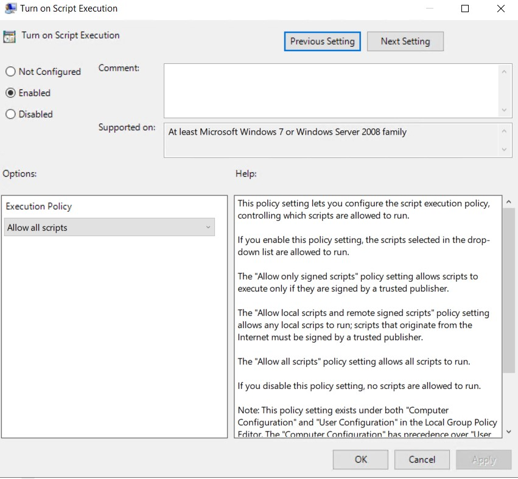

## Week 7 Homework: A Day in the Life of a Windows Sysadmin

**Task 1: Create a GPO: Disable Local Link Multicast Name Resolution (LLMNR):**


- Deliverable for Task 1: Take a screenshot of all the GPOs created for this homework assignment. To find these, launch the Group Policy Management tool, select Group Policy Objects, and take a screenshot of the GPOs you've created.


**Task 2: Create a GPO: Account Lockout:**
- Deliverable for Task 2: Submit a screenshot of the different Account Lockout policies in Group Policy Management Editor. It should show the three values you set under the Policy and Policy Setting columns.


**Task 3: Create a GPO: Enabling Verbose PowerShell Logging and Transcription:**
- Deliverable for Task 3: Submit a screenshot of the different Windows PowerShell policies within the Group Policy Management Editor. Four of these should be enabled.





**Task 4: Create a Script: Enumerate Access Control Lists:**
-Deliverable for Task 4: Submit a copy of your enum_acls.ps1 script.
  ```bash
$directory = Get-location
foreach ($item in $directory) {
    Get-ChildItem | Get-Acl 
}
  ```

**Bonus Task 5: Verify Your PowerShell Logging GPO:**
- Deliverable for Bonus Task 5: Submit a screenshot of the contents of one of your transcribed PowerShell logs or a copy of one of the logs.


