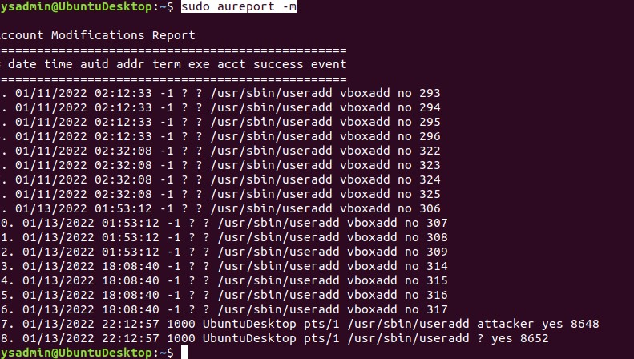

## Week 5 Homework Submission File: Archiving and Logging Data

Please edit this file by adding the solution commands on the line below the prompt.

Save and submit the completed file for your homework submission.

---

### Step 1: Create, Extract, Compress, and Manage tar Backup Archives

1. Command to **extract** the `TarDocs.tar` archive to the current directory:
```bash
tar xvvf TarDoc.tar
 ```
2. Command to **create** the `Javaless_Doc.tar` archive from the `TarDocs/` directory, while excluding the `TarDocs/Documents/Java` directory:
```bash
tar cvvf Javaless_Docs.tar --exclude="Java"  ~/Projects/TarDocs/Documents/
   ```
3. Command to ensure `Java/` is not in the new `Javaless_Docs.tar` archive:
```bash
tar tvf Javaless_Docs.tar | grep Java
  ```

**Bonus** 
- Command to create an incremental archive called `logs_backup_tar.gz` with only changed files to `snapshot.file` for the `/var/log` directory:
```bash
sudo tar cvzf logs_backup.tar.gz --listed-incremental=logs_backup.snar --level=0 /var/log
   ```
#### Critical Analysis Question

- Why wouldn't you use the options `-x` and `-c` at the same time with `tar`?
```bash
The reason why you would not use -x and -c options is because one creates and the other executes. -c option is to create the tar file and the -x option will executes the file.
  ```
---

### Step 2: Create, Manage, and Automate Cron Jobs

1. Cron job for backing up the `/var/log/auth.log` file:

```bash
0 6 * * 3 mkdir -p /var/log/auth.log
2 6 * * 3 sudo tar czf auth_backup.tgz /var/log/auth.log -C /var
  ```
---

### Step 3: Write Basic Bash Scripts

1. Brace expansion command to create the four subdirectories:
   mkdir -p  ~/backups/{freemem,diskuse,openlost,freedisk}

2. Paste your `system.sh` script edits below:

    ```bash
    #!/bin/bash
    
    cat /proc/meminfo | grep MemFree > ~/backups/freemem/free_mem.txt
    df -H | awk '{print $1, $3}' > ~/backups/diskuse/disk_usage.txt
    lsof > ~/backups/openlist/open_list.txt
    df -H | awk '{print $1, $4}' > ~/backups/freedisk/free_disk.txt

    ```

3. Command to make the `system.sh` script executable:
 ```bash
 chmod 744 system.sh
```
**Optional**
- Commands to test the script and confirm its execution:
 ```bash 
Execution Command: ./system.sh

Confirm script works:
  
~/backups/freemem
  cat free_mem.txt

~/backups/disk_usage
  cat disk_usage.txt

  ~/backups/openlist
  cat open_list.txt

~/backups/freedisk
  cat free_disk.txt
   ```

**Bonus**
- Command to copy `system` to system-wide cron directory: 
 
```bash  
crontab -e
* 0 * * 1 ~/./system.sh
   ```
---

### Step 4. Manage Log File Sizes
 
1. Run `sudo nano /etc/logrotate.conf` to edit the `logrotate` configuration file. 

    Configure a log rotation scheme that backs up authentication messages to the `/var/log/auth.log`.

    - Add your config file edits below:
    ```bash
    /var/log/auth.log {
    rotate 7
    weekly
    notifemtpy
    compress
    delaycompress
    missingok }
    ```
---

### Bonus: Check for Policy and File Violations

1. Command to verify `auditd` is active:
   ```bash 
   systemctl status auditd
    ```

2. Command to set number of retained logs and maximum log file size:

    - Add the edits made to the configuration file below:
    ```bash
    [max_log_file = 35 num_logs = 7]
    ```

3. Command using `auditd` to set rules for `/etc/shadow`, `/etc/passwd` and `/var/log/auth.log`:


    - Add the edits made to the `rules` file below:

    ```bash
     -w /etc/shadow -p wra -k hashpass_audit    
     -w /etc/passwd -p wra -k userpass_audit
     -w /var/log/auth.log -p wra -k authlog_audit
    ```

4. Command to restart `auditd`:
```bash
systemctl restart auditd
  ```
5. Command to list all `auditd` rules:
```bash
sudo auditctl -l
 ```
6. Command to produce an audit report:
```bash
sudo aureport -au
   ```
7. Create a user with `sudo useradd attacker` and produce an audit report that lists account modifications:


8. Command to use `auditd` to watch `/var/log/cron`:
```bash
sudo su - to switch to root
command: auditctl -w /var/log/cron
 ```
9.  Command to verify `auditd` rules:
   ```bash 
auditctl -l
  ```
---

### Bonus (Research Activity): Perform Various Log Filtering Techniques

1. Command to return `journalctl` messages with priorities from emergency to error 
```bash
journalctl -b -1  -p "emerg".."crit"
 ```
2. Command to check the disk usage of the system journal unit since the most recent boot:
```bash
sudo journalctl --disk-usage
```
3. Command to remove all archived journal files except the most recent two:
```bash
sudo journalctl --vacuum-time=2d.
```

4. Command to filter all log messages with priority levels between zero and two, and save output to `/home/sysadmin/Priority_High.txt`:
  ```bash 
sudo journalctl -p 0..2 > /home/student/Priority_High.txt
 ```
5. Command to automate the last command in a daily cronjob. Add the edits made to the crontab file below:

    ```bash
    * 22 * * 1-7 sudo journalctl -p 0..2 >> /home/student/Priority_High.txt
    ```

---
© 2020 Trilogy Education Services, a 2U, Inc. brand. All Rights Reserved.
