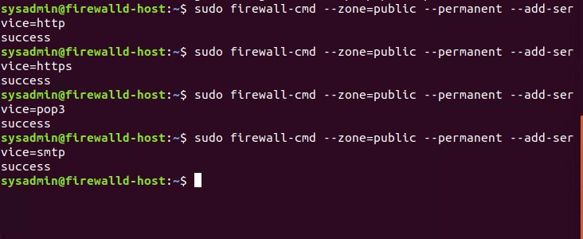
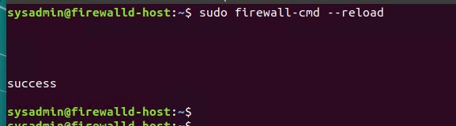

## Unit 11 Submission File: Network Security Homework 

### Part 1: Review Questions 

#### Security Control Types

The concept of defense in depth can be broken down into three different security control types. Identify the security control type of each set  of defense tactics.

1. Walls, bollards, fences, guard dogs, cameras, and lighting are what type of security control?

    Answer: Physical Control

2. Security awareness programs, BYOD policies, and ethical hiring practices are what type of security control?

    Answer:  Management Control

3. Encryption, biometric fingerprint readers, firewalls, endpoint security, and intrusion detection systems are what type of security control?

    Answer: Intrusion Precention 

#### Intrusion Detection and Attack indicators

1. What's the difference between an IDS and an IPS?

    IDS: An IDS is physically connects via a network tap or mirrored port.
    IPS: An IPS physically connects inline with the flow of data. This is placed in between the fireall and network switch.

2. What's the difference between an Indicator of Attack and an Indicator of Compromise?

   Indicator of Attack: This Indicator indicates an attack is happening in real time.
   Indicator of Compromise: This indicator indicates a orevious malicious activity.

#### The Cyber Kill Chain

Name each of the seven stages for the Cyber Kill chain and provide a brief example of each.

   Stage 1: Reconnaissance: The attacker collects data about the target and the tactics for the attack which include harverting email addresses and gathing other information. Automated scanners are used by intruders to find point of vulnerability in the system, this would include scanning firewalls, intrusion prevention systems to indicate an entry for the attack.

   Stage 2: Weaponization: Attackers developing and engineering malware based on their needs and the intention of the attack. This process will also involve the attackers trying to reduce the chances of getting detected by any security solutions.

   Stage 3: Delivery: The attacker delivers the weaponized malware via either phishing email or other ways. This is the most importing stage where the attack can be stopped by a security team.

   Stage 4: Exploitation: The malicious code has been delivered into the organization's system which causes a breach in the system. This is where the attackers have an opportunity to exploit the systems by installing tools, running malicious scripts and modifying security certificates.

   Stage 5: Installation: Installed malware to allow a backdoor or remote access trojan for the attacker.

   Stage 6: Command and Control: The attackers have gain control over the organization's systems and network which allows them to gain access to privileged accounts and attempt brute force attacks, search for credentials and change permissions to take over the control.

   Stage 7: Actions on Objective: The data has been extracted from the system by the attacker. This involves gathering, encrypting and extracting confidential information from the organization's enviroment.


#### Snort Rule Analysis

Use the Snort rule to answer the following questions:

Snort Rule #1

```bash
alert tcp $EXTERNAL_NET any -> $HOME_NET 5800:5820 (msg:"ET SCAN Potential VNC Scan 5800-5820"; flags:S,12; threshold: type both, track by_src, count 5, seconds 60; reference:url,doc.emergingthreats.net/2002910; classtype:attempted-recon; sid:2002910; rev:5; metadata:created_at 2010_07_30, updated_at 2010_07_30;)
```

1. Break down the Sort Rule header and explain what is happening.

   Answer: An alert has been trigged because and outside source as scanned TCP ports 5800-2820 on the network.

2. What stage of the Cyber Kill Chain does this alert violate?

   Answer: Stage 1: Reconnaissance

3. What kind of attack is indicated?

   Answer: An external source scanning these ports to see the vulnerability to gain access through the VNC remote control service. 

Snort Rule #2

```bash
alert tcp $EXTERNAL_NET $HTTP_PORTS -> $HOME_NET any (msg:"ET POLICY PE EXE or DLL Windows file download HTTP"; flow:established,to_client; flowbits:isnotset,ET.http.binary; flowbits:isnotset,ET.INFO.WindowsUpdate; file_data; content:"MZ"; within:2; byte_jump:4,58,relative,little; content:"PE|00 00|"; distance:-64; within:4; flowbits:set,ET.http.binary; metadata: former_category POLICY; reference:url,doc.emergingthreats.net/bin/view/Main/2018959; classtype:policy-violation; sid:2018959; rev:4; metadata:created_at 2014_08_19, updated_at 2017_02_01;)
```

1. Break down the Sort Rule header and explain what is happening.

   Answer: An alert has been trigged because an outside source has downloaded a windows executable file or DLL over HTTP possible a malicous software.

2. What layer of the Defense in Depth model does this alert violate?

   Answer: Stage 3: Delivery

3. What kind of attack is indicated?

   Answer: Possible Cross Site Scripting (XSS) has occurred.

Snort Rule #3

- Your turn! Write a Snort rule that alerts when traffic is detected inbound on port 4444 to the local network on any port. Be sure to include the `msg` in the Rule Option.

    Answer: 
    ```bash
    alert tcp $EXTERNAL_NET 4444 -> $HOME_NET any {msg: "Inbound traffic detected on port 4444"}
    ```

### Part 2: "Drop Zone" Lab

#### Log into the Azure `firewalld` machine

Log in using the following credentials:

- Username: `sysadmin`
- Password: `cybersecurity`

#### Uninstall `ufw`

Before getting started, you should verify that you do not have any instances of `ufw` running. This will avoid conflicts with your `firewalld` service. This also ensures that `firewalld` will be your default firewall.

- Run the command that removes any running instance of `ufw`.

    ```bash
    $ sudo ufw disable && sudo killall ufw && sudo systemctl disable ufw
    ```


#### Enable and start `firewalld`

By default, these service should be running. If not, then run the following commands:

- Run the commands that enable and start `firewalld` upon boots and reboots.

    ```bash
    $ sudo systemctl enable firewalld.service
    $ sudo /etc/init.d/firewalld start
    ```

  
  Note: This will ensure that `firewalld` remains active after each reboot.

#### Confirm that the service is running.

- Run the command that checks whether or not the `firewalld` service is up and running.

    ```bash
    $ sudo systemctl status firewalld
    ```


#### List all firewall rules currently configured.

Next, lists all currently configured firewall rules. This will give you a good idea of what's currently configured and save you time in the long run by not doing double work.

- Run the command that lists all currently configured firewall rules:

    ```bash
    $ sudo firewall-cmd --list-all
    ```
- Take note of what Zones and settings are configured. You many need to remove unneeded services and settings.

#### List all supported service types that can be enabled.

- Run the command that lists all currently supported services to see if the service you need is available

    ```bash
    $ sudo firewall-cmd --get-services
    ```

- We can see that the `Home` and `Drop` Zones are created by default.


#### Zone Views

- Run the command that lists all currently configured zones.

    ```bash
    $ sudo firewall-cmd --list-all-zones
    ```


- We can see that the `Public` and `Drop` Zones are created by default. Therefore, we will need to create Zones for `Web`, `Sales`, and `Mail`.

#### Create Zones for `Web`, `Sales` and `Mail`.

- Run the commands that creates Web, Sales and Mail zones.

    ```bash
    $ sudo firewall-cmd --permanent --new-zone=web
    $ sudo firewall-cmd --permanent --new-zone=sales
    $ sudo firewall-cmd --permanent --new-zone=mail
    ```

#### Set the zones to their designated interfaces:

- Run the commands that sets your `eth` interfaces to your zones.

    ```bash
    $ udo firewall-cmd --zone=public--change-interface=eth0
    $ sudo firewall-cmd --zone=web --change-interface=eth1
    $ sudo firewall-cmd --zone=sales --change-interface=eth2
    $ sudo firewall-cmd --zone=mail --change-interface=eth3
    ```


#### Add services to the active zones:

- Run the commands that add services to the **public** zone, the **web** zone, the **sales** zone, and the **mail** zone.

- Public:

    ```bash
    $ sudo firewall-cmd --zone=public --permanent --add-service=http
    $ sudo firewall-cmd --zone=public --permanent --add-service=https
    $ sudo firewall-cmd --zone=public --permanent --add-service=pop3
    $ sudo firewall-cmd --zone=public --permanent --add-service=stmp
    ```

- Web:

    ```bash
    $ sudo firewall-cmd --zone=web --permanent --add-service=http
    ```

- Sales

    ```bash
    $ sudo firewall-cmd --zone=sales --permanent --add-service=https
    ```

- Mail

    ```bash
    $ sudo firewall-cmd --zone=mail --permanent --add-service=smtp
    $ sudo firewall-cmd --zone=mail --permanent --add-service=pop3
    ```

- What is the status of `http`, `https`, `smtp` and `pop3`?
  
  the status of `http`, `https`, `smtp` and `pop3` are all enabled.
  

#### Add your adversaries to the Drop Zone.

- Run the command that will add all current and any future blacklisted IPs to the Drop Zone.

     ```bash
    $ sudo firewall-cmd --zone-drop --add-rich-rule='rule family="ipv4" source address="10.208.56.23" reject'
    $ sudo firewall-cmd --zone-drop --add-rich-rule='rule family="ipv4" source address="135.95.103.76" reject'
    $ sudo firewall-cmd --zone-drop --add-rich-rule='rule family="ipv4" source address="76.34.169.118" reject'
    ```


#### Make rules permanent then reload them:

It's good practice to ensure that your `firewalld` installation remains nailed up and retains its services across reboots. This ensure that the network remains secured after unplanned outages such as power failures.

- Run the command that reloads the `firewalld` configurations and writes it to memory

    ```bash
    $ sudo firewall-cmd --reload
    ```


#### View active Zones

Now, we'll want to provide truncated listings of all currently **active** zones. This a good time to verify your zone settings.

- Run the command that displays all zone services.

    ```bash
    $ sudo firewall-cmd --list-all-zones
    ```


#### Block an IP address

- Use a rich-rule that blocks the IP address `138.138.0.3`.

    ```bash
    $ sudo firewall-cmd --zone=public --add-rich-rule='rule family="ipv4" source address="138.138.0.3" reject' --permanent
    ```


#### Block Ping/ICMP Requests

Harden your network against `ping` scans by blocking `icmp ehco` replies.

- Run the command that blocks `pings` and `icmp` requests in your `public` zone.

    ```bash
    $ sudo firewall-cmd --zone=public -add-icmp-block=echo-reply --add-icmp-block=echo-request --permanent
    ```


#### Rule Check

Now that you've set up your brand new `firewalld` installation, it's time to verify that all of the settings have taken effect.

- Run the command that lists all  of the rule settings. Do one command at a time for each zone.

    ```bash
    $ sudo firewall-cmd --zone=public --list-all
    $ sudo firewall-cmd --zone=web --list-all
    $ sudo firewall-cmd --zone=sales --list-all
    $ sudo firewall-cmd --zone=mail --list-all
    $ sudo firewall-cmd --zone=drop --list-all
    ```

- Are all of our rules in place? If not, then go back and make the necessary modifications before checking again.


Congratulations! You have successfully configured and deployed a fully comprehensive `firewalld` installation.

---

### Part 3: IDS, IPS, DiD and Firewalls

Now, we will work on another lab. Before you start, complete the following review questions.

#### IDS vs. IPS Systems

1. Name and define two ways an IDS connects to a network.

   Answer 1: Network tap: This is a hardware device that provides access to a network. The device transit both inbound and outbound data streams on separate channels at the same time. This means that all data arriving will be monitored in real time through the device.

   Answer 2: SPAN (Switched Port Analyzer) This connection mirrors all network data to another physical port where the packets can be captured and analyzed.

2. Describe how an IPS connects to a network.

   Answer: An IPS physically connects inline with the flow of data. This is placed in between the fireall and network switch.

3. What type of IDS compares patterns of traffic to predefined signatures and is unable to detect Zero-Day attacks?

   Answer: Signature-based.

4. Which type of IDS is beneficial for detecting all suspicious traffic that deviates from the well-known baseline and is excellent at detecting when an attacker probes or sweeps a network?

   Answer: Anomaly-based.

#### Defense in Depth

1. For each of the following scenarios, provide the layer of Defense in Depth that applies:

    1.  A criminal hacker tailgates an employee through an exterior door into a secured facility, explaining that they forgot their badge at home.

        Answer: Preventive

    2. A zero-day goes undetected by antivirus software.

        Answer:  Deterrent

    3. A criminal successfully gains access to HR’s database.

        Answer: Corrective

    4. A criminal hacker exploits a vulnerability within an operating system.

        Answer: Corrective

    5. A hacktivist organization successfully performs a DDoS attack, taking down a government website.

        Answer: Compensating

    6. Data is classified at the wrong classification level.

        Answer: Corrective

    7. A state sponsored hacker group successfully firewalked an organization to produce a list of active services on an email server.

        Answer: Detective

2. Name one method of protecting data-at-rest from being readable on hard drive.

    Answer: Data Encryption

3. Name one method to protect data-in-transit.

    Answer: Data Encryption

4. What technology could provide law enforcement with the ability to track and recover a stolen laptop.

   Answer: Police track laptops through the installation of hardware or software that will help identify and locate the laptop if it is stolen.

5. How could you prevent an attacker from booting a stolen laptop using an external hard drive?

    Answer: By enabling BitLocker


#### Firewall Architectures and Methodologies

1. Which type of firewall verifies the three-way TCP handshake? TCP handshake checks are designed to ensure that session packets are from legitimate sources.

  Answer: Stateful firewall

2. Which type of firewall considers the connection as a whole? Meaning, instead of looking at only individual packets, these firewalls look at whole streams of packets at one time.

  Answer: Network Firewall

3. Which type of firewall intercepts all traffic prior to being forwarded to its final destination. In a sense, these firewalls act on behalf of the recipient by ensuring the traffic is safe prior to forwarding it?

  Answer: Proxy Firewall


4. Which type of firewall examines data within a packet as it progresses through a network interface by examining source and destination IP address, port number, and packet type- all without opening the packet to inspect its contents?

  Answer: Stateless firewall


5. Which type of firewall filters based solely on source and destination MAC address?

  Answer: MAC layer filtering firewall


### Bonus Lab: "Green Eggs & SPAM"
In this activity, you will target spam, uncover its whereabouts, and attempt to discover the intent of the attacker.
 
- You will assume the role of a Jr. Security administrator working for the Department of Technology for the State of California.
 
- As a junior administrator, your primary role is to perform the initial triage of alert data: the initial investigation and analysis followed by an escalation of high priority alerts to senior incident handlers for further review.
 
- You will work as part of a Computer and Incident Response Team (CIRT), responsible for compiling **Threat Intelligence** as part of your incident report.

#### Threat Intelligence Card

**Note**: Log into the Security Onion VM and use the following **Indicator of Attack** to complete this portion of the homework. 

Locate the following Indicator of Attack in Sguil based off of the following:

- **Source IP/Port**: `188.124.9.56:80`
- **Destination Address/Port**: `192.168.3.35:1035`
- **Event Message**: `ET TROJAN JS/Nemucod.M.gen downloading EXE payload`

Answer the following:

1. What was the indicator of an attack?
   - Hint: What do the details of the reveal? 

    Answer: Red Alert on analyst concole(ET trojan js/nemucod.m.gen downloading exe payload)

Alert Profile:

- Source IP: 188.124.9.56
- Destination IP: 192.168.3.35
- Source port: 80
- Destination port: 1035
- Infection type (Trojan, Virus, Worm, etc.): Trojan


1. What was the adversarial motivation (purpose of attack)?

    Answer: To distribute malware which can be used to steal info/accreditation.

2. Describe observations and indicators that may be related to the perpetrators of the intrusion. Categorize your insights according to the appropriate stage of the cyber kill chain, as structured in the following table.

| TTP | Example | Findings |
| --- | --- | --- | 
| **Reconnaissance** |  How did they attacker locate the victim? | E-mail Addresses
| **Weaponization** |  What was it that was downloaded?| Malware/Trojan Horse
| **Delivery** |    How was it downloaded?| Social-engineered email to appear legitimate
| **Exploitation** |  What does the exploit do?| Phishing
| **Installation** | How is the exploit installed?| When a rexipient opens the attached ZIP file and runs the JavaScript file that contains the Malware
| **Command & Control (C2)** | How does the attacker gain control of the remote machine?| Attackers uses malicious code to gain remote access/control over the computer. They utilize a C2 server which is controlled by the attacker to send commands and receive stolen data from the compromised computer.
| **Actions on Objectives** | What does the software that the attacker sent do to complete it's tasks?| Encrypt data that is stored on the targeted PC and demand ransoms in exchange for the decryption tool.

1. What are your recommended mitigation strategies?
   
    Answer: 
- Anti-virus can automatically quarantine suspicious files.
- Network Intrusion Prevention.
- Restrict Web-Based Content.
- Software Configuration - anti-spoofing and email authentication mechanisms to filter messages.
- Users can be trained to identify social engineering techniques and phishing emails.
  


2. List your third-party references.

- https://www.2-spyware.com/remove-js-nemucod.html
- https://www.f-secure.com/v-descs/trojan-downloader_js_nemucod.shtml
- https://blog.teamascend.com/phishing-and-c2#:~:text=A%20Command%20%26%20Control%20(C2)%20attack%20uses%20malicious%20code%20to,stolen%20data%20from%20compromised%20machines.


---

© 2020 Trilogy Education Services, a 2U, Inc. brand. All Rights Reserved.
