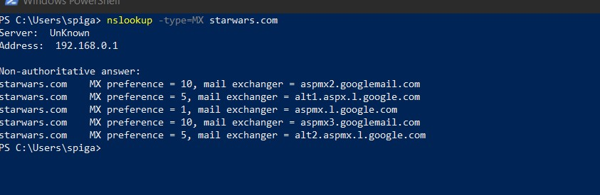
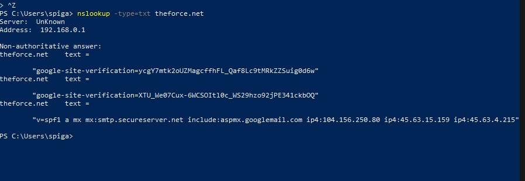
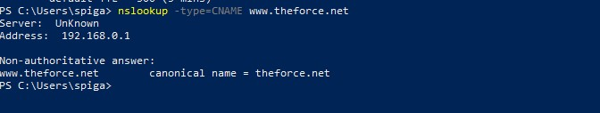
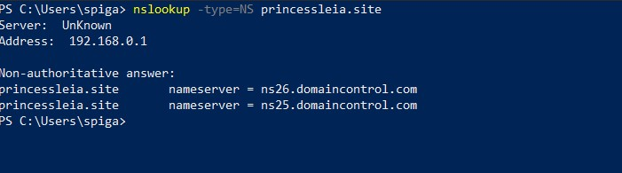
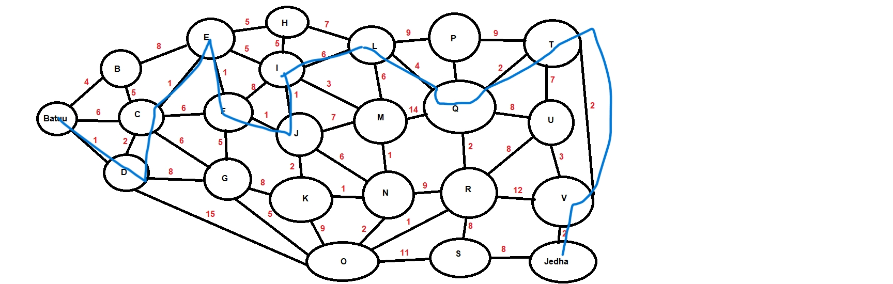
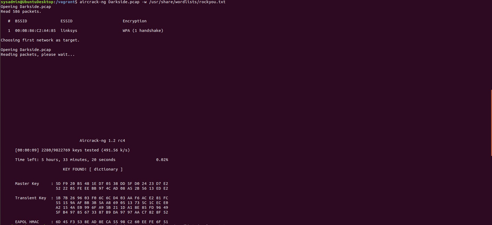
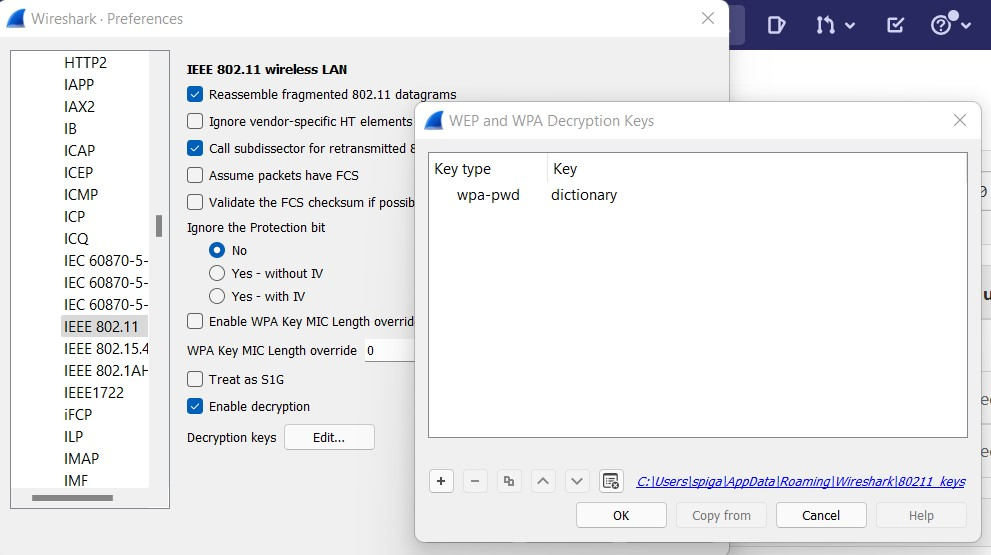
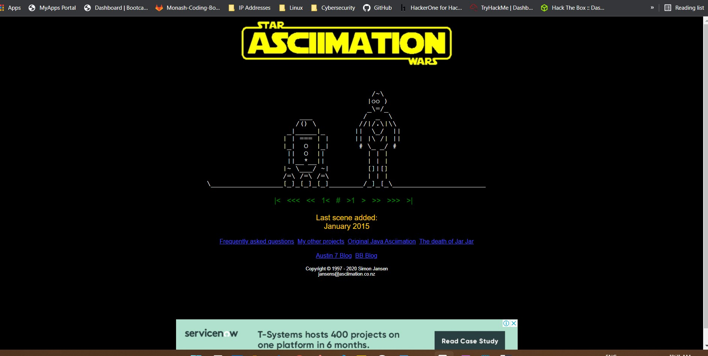

## Networks Fundamentals II Homework: In a Network Far, Far Away!

#### Mission 1:

Your mission:

• Determine and document the mail servers for starwars.com using NSLOOKUP.

Using command: `nslookup -type=MX starwars.com`, The mail servers come up as: 

    Non-authoritative answer:
    starwars.com    MX preference = 10, mail exchanger = aspmx2.googlemail.com
    starwars.com    MX preference = 5, mail exchanger = alt1.aspx.l.google.com
    starwars.com    MX preference = 1, mail exchanger = aspmx.l.google.com
    starwars.com    MX preference = 10, mail exchanger = aspmx3.googlemail.com
    starwars.com    MX preference = 5, mail exchanger = alt2.aspmx.l.google.com 

• Explain why the Resistance isn't receiving any emails:

The reason why the Resistance isn’t receiving any emails is because their MX record is not set up to the proper primary and secondary email servers. This should be the new servers.

• Document what a corrected DNS record should be:
     
      Non-authoritative answer:
        starwars.com mail exchanger = 5 alt2.aspmx.l.google.com
        starwars.com mail exchanger = 1 aspmx.l.google.com
        starwars.com mail exchanger = 10 aspmx3.googlemail.com
        starwars.com mail exchanger = 10 aspmx2.googlemail.com
        starwars.com mail exchanger = 5 alt1.aspx.l.google.com

#### Mission 2

Your mission:

• Determine and document the SPF for theforce.net using NSLOOKUP.

Using command: `nslookup -type=txt theforce.net`, the following shows the sender policy frame work:

Non-authoritative answer:
theforce.net    text =

        google-site-verification=ycgY7mtk2oUZMagcffhFL_Qaf8Lc9tMRkZZSuig0d6w
theforce.net    text =

        google-site-verification=XTU_We07Cux-6WCSOItl0c_WS29hzo92jPE341ckbOQ
theforce.net    text =

        v=spf1 a mx mx:smtp.secureserver.net include:aspmx.googlemail.com ip4:104.156.250.80 ip4:45.63.15.159 ip4:45.63.4.215

• Explain why the Force's emails are going to spam:

The reason for any mail coming from theforce.net is going to the spam folder is because their IPv4 address 45.23.176.21 that was set up when changing the IP address, is not recognised as a secure server or a problem retrieving the record for the domain.

• Document what a corrected DNS record should be:

    v=spf1 a mx mx:smtp.secureserver.net include:aspmx.googlemail.com ip4:104.156.250.80 ip4:45.63.15.159 ip4:45.63.4.215 ipv4:45.23.176.21

#### Mission 3

Your mission:

•  Document how a CNAME should look by viewing the CNAME of www.theforce.net using NSLOOKUP:
Using command `nslookup -type=CNAME www.theforce.net`, the DNS record looks like:

     Non-authoritative answer:
     www.theforce.net        canonical name = theforce.net

     

• Explain why the sub page of resistance.theforce.net isn't redirecting to theforce.net:

The DNS CNAME is missing a referance from resistance.theforce.net to www.theforce.net

• Document what a corrected DNS record should be:
    
    www.theforce.net         canonical name = theforce.net
    resistance.theforce.net     canonical name = www.theforce.net

#### Mission 4
 
 Your mission:

• Confirm the DNS records for princessleia.site:
Using the command `nslookup -type=NS princessleia.site`, the records show:

    Non-authoritative answer:
    princessleia.site       nameserver = ns26.domaincontrol.com
    princessleia.site       nameserver = ns25.domaincontrol.com

•  Document how you would fix the DNS record to prevent this issue from happening again:

To prevent this issue from happening again, you require to add a referance to the backup DNS server.
    
    princessleia.site nameserver = ns25.domaincontrol.com
    princessleia.site nameserver = ns2.galaxybackup.com

#### Mission 5
• Determine the OSPF shortest path from Batuu to Jedha:
    
    D   C   E   F   J   I   L   Q   T   V
    1   2   1   1   1   1   6   4   2   2   = 21 hops

 • Confirm your path doesn't include Planet N in its route:

    D   C   E   F   J   I   L   Q   T   V

• Document this shortest path so it can be used by the Resistance to develop a static route to improve the traffic:

    Planet Batuu   >   Planet D   >   Planet C   >   Planet E   >   Planet F   >   Planet J   >   Planet I   >   Planet L   >   Planet Q   >   Planet T   >   Planet V   >   Planet Jedha

#### Mission 6

Your Mission:

• Figure out the Dark Side's secret wireless key by using Aircrack-ng:
Command: 
       
`aircrack-ng Darkside.pcap -w /usr/share/wordlists/rockyou.txt`

WPA Passpass: dictionary

• Use the Dark Side's key to decrypt the wireless traffic in Wireshark:
     
     wpa-pwd: dictonary

• Host IP Addresses and MAC Addresses by looking at the decrypted ARP traffic.

ARP Protocol Specific Addresses:
     
     IP Address: 172.16.0.01 is at MAC Address: 00:0f:66:e3:e4:01
     IP Address: 172.16.0.101 is at MAC Address: 00:13:ce:55:98:ef

Other Addresses:
     
     IP: 10.1.1.50 MAC: 00:13:ce:55:98:ef
     IP: 68.9.16.25 MAC: 00:0f:66:e3:e4:01
     IP: 68.9.16.30 MAC: 00:0f:66:e3:e4:01      

•  Document these IP and MAC Addresses, as the resistance will use these IP addresses to launch a retaliatory attack:

     IP Address: 172.16.0.01 MAC Address: 00:0f:66:e3:e4:01
     IP Address: 172.16.0.101 MAC Address: 00:13:ce:55:98:ef

#### Mission 7

Using command: `nslookup -type=TXT princessleia.site`

Text found:
 "Run the following in a command line: telnet towel.blinkenlights.nl or as a backup access in a browser: www.asciimation.co.nz"

