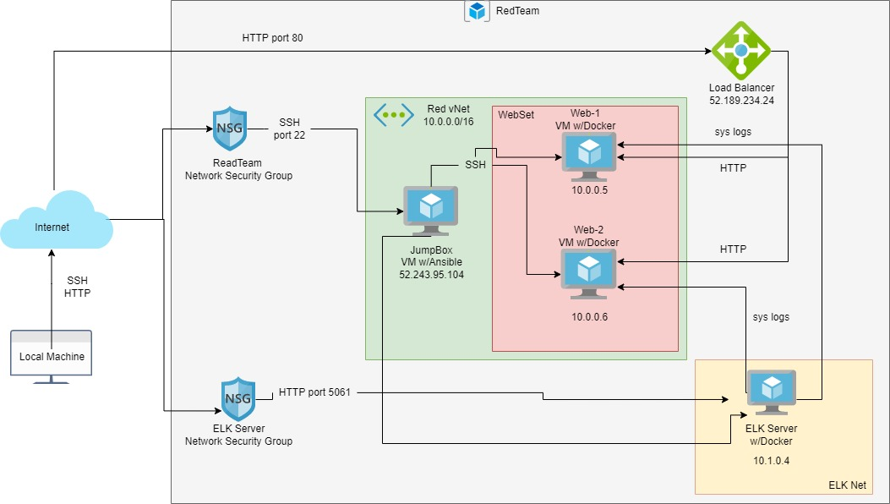
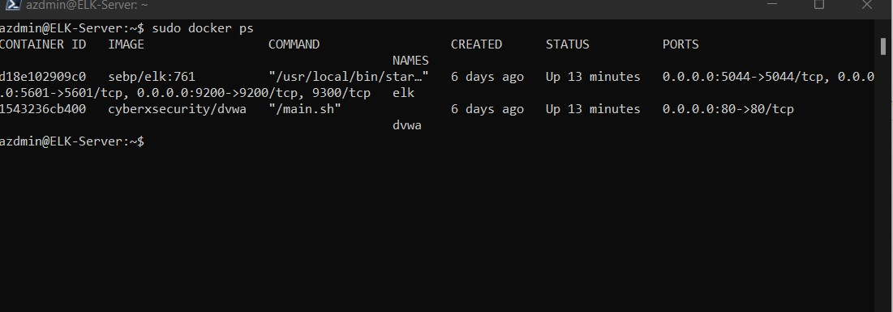

## Automated ELK Stack Deployment

The files in this repository were used to configure the network depicted below.



These files have been tested and used to generate a live ELK deployment on Azure. They can be used to either recreate the entire deployment pictured above. Alternatively, select portions of the yml and config file may be used to install only certain pieces of it, such as Filebeat.


This document contains the following details:
- Description of the Topology
- Access Policies
- ELK Configuration
  - Beats in Use
  - Machines Being Monitored
- How to Use the Ansible Build


### Description of the Topology

The main purpose of this network is to expose a load-balanced and monitored instance of DVWA, the D*mn Vulnerable Web Application.

Load balancing ensures that the application will be highly protected against distributed denial-of-service (DDoS) attacks, in addition to restricting a secure computer to the network.

Integrating an ELK server allows users to easily monitor the vulnerable VMs for changes to the data and system logs.


| Name     | Function  | IP Address | Operating System |
|----------|---------- |------------|------------------|
| Jump Box |Gateway    | 10.0.0.1/52.243.95.104| Linux |
| Web1     |Web Server | 10.0.0.5   | Linux            |
| Web2     |Web Server | 10.0.0.6   | Linux            |
| ELK      |ELK Server | 10.1.0.4   | Linux            |
| Load Balancer|Load Balancer|Static External IP | Linux|
| Workstation |Access Control |External IP or PublicIP| Linux |

### Access Policies

The machines on the internal network are not exposed to the public Internet. 

Only the Elk Server machine can accept connections from the Internet. Access to this machine is only allowed from the following IP addresses:
- Workstation Public IP through TCP 5601.

Machines within the network can only be accessed by Workstation and JumpBox.
Which machine did you allow to access your ELK VM? What was its IP address?
- JumpBox IP : 52.243.95.104 via SSH port 22
- Workstation Public IP via port TCP 5601

A summary of the access policies in place can be found in the table below.

| Name     | Publicly Accessible | Allowed IP Addresses |
|----------|---------------------|----------------------|
| Jump Box | Yes                 | 52.243.95.104        |
| Web-1    | No                  | 10.1.0.4             |
| Web-2    | No                  | 10.1.0.4             |
| ELK Server| No                 | 10.1.0.4             |

### Elk Configuration

Ansible was used to automate configuration of the ELK machine. No configuration was performed manually, which is advantageous because...What is the main advantage of automating configuration with Ansible?
- Free: Ansible is an open-source tool.
- Very simple to set up and use: No special coding skills are necessary to use Ansible’s playbooks (more on playbooks later).
- Powerful: Ansible lets you model even highly complex IT workflows. 
- Flexible: You can orchestrate the entire application environment no matter where it’s deployed. You can also customize it based on your needs.
- Agentless: You don’t need to install any other software or firewall ports on the client systems you want to automate. You also don’t have to set up a separate management structure.
- Efficient: Because you don’t need to install any extra software, there’s more room for application resources on your server.

The playbook implements the following tasks: In 3-5 bullets, explain the steps of the ELK installation play. E.g., install Docker; download image; etc.
- Install docker.io
- Install pip3
- Install Docker python module
- Increase virtual memory
- Download and launch a docker
  

The following screenshot displays the result of running `docker ps` after successfully configuring the ELK instance.



### Target Machines & Beats
This ELK server is configured to monitor the following machines:
- Web-1: IP 10.0.0.5
- Web-2: IP 10.0.0.6

We have installed the following Beats on these machines:
- Microbeats

These Beats allow us to collect the following information from each machine:
- Filebeat - collects data about the file system.
- Metricbeat - collects machine metrics, such as uptime.

### Using the Playbook
In order to use the playbook, you will need to have an Ansible control node already configured. Assuming you have such a control node provisioned: 

SSH into the control node and follow the steps below:
- Copy the playbook file to Ansible Control Node.
- Update the hosts file to include web server and ELK.
- Run the playbook, and navigate to Kibana (http://[Host IP]/app/kibana#/home) to check that the installation worked as expected.

- Commands to run and download the playbook, update the files:
```Bash
cd /etc/ansible
 $ ansible-playbook install_elk.yml elk
 $ ansible-playbook install_filebeat.yml webservers
 $ ansible-playbook install_metricbeat.yml webservers
```